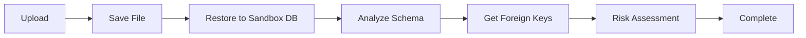

# PgDumpLens User Guide

This guide explains how to use PgDumpLens's main features step by step.

## 📚 Table of Contents

1. [Uploading Dump Files](#1-uploading-dump-files)
2. [Schema Explorer](#2-schema-explorer)
3. [Relationship Explorer](#3-relationship-explorer)
4. [Full-Text Search](#4-full-text-search)
5. [JSON Viewer](#5-json-viewer)
6. [Understanding Risk Assessment](#6-understanding-risk-assessment)
7. [Multi-Database Support](#7-multi-database-support)
8. [Dump Diff Comparison](#8-dump-diff-comparison)
   - [Schema Diff](#understanding-the-diff-summary)
   - [Data Diff Detection](#data-diff-detection)
   - [Data Diff Viewer](#data-diff-viewer)
9. [Deleting Dumps](#9-deleting-dumps)
10. [URL State Persistence](#10-url-state-persistence)

---

## 1. Uploading Dump Files

### Supported Formats

PgDumpLens supports the following PostgreSQL dump file formats:

| Format         | Command Example                                   | File Extensions       |
| -------------- | ------------------------------------------------- | --------------------- |
| **Plain SQL**  | `pg_dump -Fp database_name > dump.sql`            | `.sql`                |
| **Custom**     | `pg_dump -Fc database_name > dump.dump`           | `.dump`, `.backup`    |
| **Gzip**       | `pg_dump -Fp database_name \| gzip > dump.sql.gz` | `.sql.gz`, `.dump.gz` |
| **pg_dumpall** | `pg_dumpall > all_databases.sql`                  | `.sql`                |

> **💡 Tip**: File extensions don't matter. Format is auto-detected by magic bytes.

### Upload Steps

#### Method 1: Via Web Browser

1. **Access the Homepage**

   ```text
   http://localhost:3000
   ```

2. **Click "Upload New Dump"**

3. **Select a File**
   - Drag & drop
   - Or click "Browse files" to select

4. **Enter Dump Name (Optional)**

   ```text
   Example: Production DB Backup 2025-12-22
   ```

5. **Click "Upload & Analyze"**

6. **Table Data Selection (Optional)**
   - After upload, a table list is displayed
   - Each table shows estimated row count (Rows approx)
   - Uncheck tables you want to exclude from the restore
   - ⚠️ **FK Constraint Warning**: If other tables reference a table you're excluding, a warning is displayed

> **💡 FK Constraint Warning**: For example, if you exclude the `users` table and the `orders` table references `users`, the `orders` data import may also fail. Check the dependent tables shown in the warning and exclude them together if necessary.

#### Method 2: Via Command Line (CLI)

**Linux/Mac:**

```bash
# Basic upload
./scripts/upload-dump.sh ./backup.sql "My Database" http://localhost:8080

# Upload as public dump (shown in Recent Dumps)
./scripts/upload-dump.sh ./backup.sql "My Database" --public

# Upload with table exclusions
./scripts/upload-dump.sh ./backup.sql --exclude-tables 'public.large_logs,public.audit_trail'

# Preview tables before restore
./scripts/upload-dump.sh ./backup.sql --preview-tables

# Combined example
./scripts/upload-dump.sh ./backup.sql "Production" http://localhost:8080 --public --preview-tables --exclude-tables 'public.large_logs'
```

**Windows (PowerShell):**

```powershell
# Basic upload
.\scripts\upload-dump.ps1 -DumpFile .\backup.sql -Name "My Database" -ServerUrl http://localhost:8080

# Upload as public dump
.\scripts\upload-dump.ps1 -DumpFile .\backup.sql -Name "My Database" -Public

# Upload with table exclusions
.\scripts\upload-dump.ps1 -DumpFile .\backup.sql -ExcludeTables 'public.large_logs','public.audit_trail'

# Preview tables before restore
.\scripts\upload-dump.ps1 -DumpFile .\backup.sql -PreviewTables

# Combined example
.\scripts\upload-dump.ps1 -DumpFile .\backup.sql -Name "Production" -Public -PreviewTables -ExcludeTables 'public.large_logs'
```

**CLI Options:**

| Option (Bash)           | Option (PowerShell)   | Description                                                        |
| ----------------------- | --------------------- | ------------------------------------------------------------------ |
| `--public`              | `-Public`             | Show in Recent Dumps list (default: private)                       |
| `--exclude-tables LIST` | `-ExcludeTables LIST` | Comma-separated list of tables to exclude (format: `schema.table`) |
| `--preview-tables`      | `-PreviewTables`      | Show table list in the dump before restore                         |

### Processing Flow

After upload, the following processes run automatically:



⏱️ **Estimated Processing Time**:

- Small DB (< 100 tables): 10-30 seconds
- Medium DB (100-500 tables): 30 seconds - 2 minutes
- Large DB (> 500 tables): 2-10 minutes

---

## 2. Schema Explorer

After dump analysis completes, the Schema Explorer is displayed.

### Main Features

#### 📊 ER Diagram (Entity Relationship Diagram)

**How to View**: Click the "ER Diagram" tab at the top of the page

```
┌─────────────┐       ┌──────────────┐       ┌────────────┐
│   users     │───────│   orders     │───────│order_items │
│─────────────│       │──────────────│       │────────────│
│ id (PK)     │1     N│ id (PK)      │1     N│ id (PK)    │
│ email       │       │ user_id (FK) │       │ order_id   │
│ name        │       │ total        │       │ product_id │
└─────────────┘       └──────────────┘       └────────────┘
```

**Features**:

- 🔍 Zoom in/out
- 📋 Copy Mermaid code
- 📷 Export as PNG image

#### 🔍 Table Search

**How to Use**:

1. Enter table or column name in the search box
2. Real-time filtering

```
🔍 [user___________]
   ↓ 3 matches
   • users
   • user_profiles
   • user_sessions
```

#### 📋 Table List

Each table displays the following information:

| Item             | Description        | Example Display                    |
| ---------------- | ------------------ | ---------------------------------- |
| **Table Name**   | schema.table       | `public.users`                     |
| **Row Count**    | Estimated rows     | `1.2K rows`                        |
| **Foreign Keys** | Relationship count | `→ 3` (Outbound) / `← 5` (Inbound) |
| **Risk**         | Deletion impact    | 🔴 Critical (85/100)                |

#### 📑 Column Details

Click a table to expand column information:

```
users (1,234 rows)
├─ id               bigint          PK  NOT NULL
├─ email            varchar(255)        NOT NULL  UNIQUE
├─ name             varchar(100)        NULL
├─ created_at       timestamp           NOT NULL  DEFAULT now()
└─ department_id    integer         FK  → departments.id
```

**Icon Meanings**:

- 🔑 **PK**: Primary Key
- 🔗 **FK**: Foreign Key
- ❗ **NOT NULL**: Cannot be null
- ⭐ **UNIQUE**: Unique constraint

#### 📊 Data Preview

**How to View**: Click the "View Data" button

**Features**:

- Pagination (default: 50 rows/page)
- Sort by column
- Value filtering
- Explore related data from cell values
- 🔄 Transpose view (swap rows and columns)
- 📋 Data copy (CSV/JSON format, cell value copy)

##### Transpose View Mode

Switch between row and column views. Useful for tables with many columns or when you want to view data vertically.

```
Normal View:                 Transposed View:
┌────┬───────┬─────┐         ┌──────────┬─────────────┐
│ id │ name  │email│         │ Column   │ Row 1       │
├────┼───────┼─────┤         ├──────────┼─────────────┤
│ 1  │ Alice │ ... │   →     │ id       │ 1           │
│ 2  │ Bob   │ ... │         │ name     │ Alice       │
└────┴───────┴─────┘         │ email    │ alice@...   │
                              └──────────┴─────────────┘
```

##### Copying Data

Click the copy button (📋) to copy in the following formats:

| Format   | Description                | Use Case                         |
| -------- | -------------------------- | -------------------------------- |
| **CSV**  | Comma-separated format     | Paste into Excel, spreadsheets   |
| **JSON** | JSON array format          | Use in programs, API integration |
| **Cell** | Copy individual cell value | Transfer individual values       |

> **💡 Tip**: When in transposed view, copy functions respect the transposed orientation.

---

## 3. Relationship Explorer

Click a cell in the table data to display its reference relationships.

### FK (Foreign Key) Column Visual Indicators

**Icons displayed in data table column headers**:

| Icon | Meaning                   | Description                                         |
| ---- | ------------------------- | --------------------------------------------------- |
| ⬅️    | **Inbound** (Referenced)  | This column is referenced by other tables (PK side) |
| 🔗    | **Outbound** (References) | This column references other tables (FK side)       |
| ⬅️🔗   | **Both**                  | Both (referenced by others and references others)   |

**Example**:

```
Column Header Display:
┌──────────────┬─────────────────┬──────────────────┐
│ ⬅️ id        │ 🔗 department_id │ name            │
│ (4 tables)   │ (departments)   │                 │
└──────────────┴─────────────────┴──────────────────┘
     ↓                 ↓               ↓
  id is            department_id   name has
  referenced by    references      no FK
  4 tables         departments
```

**Tooltip**: Hover over icons to see referenced/referencing table names.

### How to Use

1. **View Data**

   ```
   Open users table → View Data
   ```

2. **Check FK Indicators**
   - If column headers have ⬅️ or 🔗, that column has related tables
   - Hover over icons for details

3. **Click a Cell**

   ```
   Click id = 123
   ```

4. **Related Information Appears**

### Display Content

#### 🔼 Outbound References (This table references)

```
users.department_id = 5

[Outbound]
👉 departments.id
   • References public.departments table
   • JOIN example:
     SELECT * FROM users u
     INNER JOIN departments d ON u.department_id = d.id
     WHERE u.department_id = 5;
```

#### 🔽 Inbound References (Referenced by other tables)

```
users.id = 123

[Inbound]
📥 orders → users (450 rows)
   Risk: 🟠 High (65/100)
   • 450 rows referencing
   • DELETE CASCADE is set
   • Deletion will also delete related orders

📥 comments → users (28 rows)
   Risk: 🟢 Low (20/100)
   • 28 rows referencing
   • Limited impact
```

### Risk Score Meanings

| Level          | Score  | Description                           |
| -------------- | ------ | ------------------------------------- |
| 🟢 **Low**      | 0-25   | Small impact. Safe to modify          |
| 🟡 **Medium**   | 26-50  | Moderate impact. Proceed with caution |
| 🟠 **High**     | 51-75  | Wide impact. Be careful               |
| 🔴 **Critical** | 76-100 | Severe impact. CASCADE deletion risk  |

### Using SQL Examples

The Relationship Explorer shows executable SQL query samples:

```sql
-- Get referencing data
SELECT * FROM orders
WHERE user_id = 123
LIMIT 100;

-- JOIN to check related data
SELECT 
    u.id,
    u.name,
    o.id as order_id,
    o.total
FROM users u
INNER JOIN orders o ON u.id = o.user_id
WHERE u.id = 123;
```

**💡 Tip**: Use the copy button on the top right to copy SQL and run it on your actual DB.

---

## 4. Full-Text Search

Search for specific values across the entire database.

### How to Use

1. **Open the Search Tab**

   ```
   Dump detail page → 🔍 Full-Text Search tab
   ```

2. **Enter Search Keywords**

   ```
   Examples: example.com
             12345
             fd8cadd3-babd-4cda-a7aa-09221a606b20
   ```

3. **Specify Search Scope (Optional)**
   - **All Databases**: Search all databases
   - **Specific DB**: Select from dropdown

4. **Click Search Button or Press Enter**

### Search Results

#### Summary Information

```
Found 11 result(s) for "example.com" (searched 181 table(s))
```

#### Detailed Results

```
┌─────────────────────────────────────────────────────────────┐
│ 📁 domainmanager › public › users › email                   │
├─────────────────────────────────────────────────────────────┤
│ Matched Value:                                              │
│ admin@example.com                                           │
│                                                             │
│ ▼ Show full row data                                       │
│                                                             │
│ SQL to reproduce this search:                               │
│ SELECT * FROM "public"."users"                              │
│ WHERE CAST("email" AS TEXT) ILIKE '%example.com%'          │
│ LIMIT 10;                                                   │
│ [Copy SQL]                                                  │
└─────────────────────────────────────────────────────────────┘
```

**Explanation of Each Item**:

1. **📁 Location Path**
   - Database name › Schema name › Table name › Column name

2. **Matched Value**
   - The value that matched the search
   - Highlighted

3. **Show full row data**
   - Click to display the entire row in JSON format
   - View other column values

4. **SQL to reproduce this search**
   - SQL query to run the same search on your actual DB
   - Copy and execute directly

### Searchable Data Types

The following column data types are searchable:

- ✅ `TEXT`
- ✅ `VARCHAR`
- ✅ `CHAR`
- ✅ `JSON`
- ✅ `JSONB`

### Search Tips

**Partial Match Search**:

```
Search: "example"
Matches: "user@example.com", "example_user", "test_example_123"
```

**UUID Search**:

```
Search: "fd8cadd3-babd-4cda-a7aa-09221a606b20"
Exact match: UUID types are also cast to TEXT for searching
```

**Hostname Search**:

```
Search: "192.168.1.100"
Matches: IP addresses, URLs, hostnames in config files, etc.
```

### Search Result Use Cases

#### Personal Data Inventory

```
Search: "john.doe@company.com"
→ Identify which tables store this email address
→ GDPR compliance impact assessment
```

#### Configuration Value Tracking

```
Search: "api.external-service.com"
→ Find where external service endpoints are configured
→ Consider extracting to environment variables
```

#### Data Integrity Check

```
Search: User ID "12345" scheduled for deletion
→ Discover tables with remaining references
→ Use for pre-deletion cleanup work
```

---

## 5. JSON Viewer

Formats and displays JSON/JSONB column values.

### How to Open

**Click a JSON cell in the data table**

```
settings table → Click value in config column
```

### Display Content

#### Metadata

```
Type: object
Size: 245 bytes
```

#### Formatted JSON

```json
{
  "notification": {
    "email": true,
    "push": false,
    "frequency": "daily"
  },
  "theme": {
    "mode": "dark",
    "color": "blue"
  },
  "features": [
    "beta",
    "experimental"
  ]
}
```

### Features

- 📋 **Copy to Clipboard**: One-click copy
- 🎨 **Syntax Highlighting**: Easy-to-read color coding
- 📏 **Auto Indent**: Formatted with 2 spaces

### Supported JSON Formats

| Format          | Example                 | Description         |
| --------------- | ----------------------- | ------------------- |
| **Object**      | `{"key": "value"}`      | JSON object         |
| **Array**       | `[1, 2, 3]`             | JSON array          |
| **JSON String** | `"{\"key\":\"value\"}"` | Escaped JSON string |

> **💡 Tip**: Even JSON stored as strings is automatically parsed and displayed.

---

## 6. Understanding Risk Assessment

### Table-Level Risk

**How to Check**: Table list in Schema Explorer

```
users                        🔴 Critical (85/100)
├─ 5 Inbound foreign keys
├─ 3 CASCADE delete settings
├─ Large table with 10,000+ rows
└─ Primary key widely referenced by other tables
```

#### Risk Score Factors

| Factor             | Points  | Description                           |
| ------------------ | ------- | ------------------------------------- |
| **Inbound FK**     | 10 each | Number of tables referencing this one |
| **CASCADE Delete** | 15 each | Foreign keys that cascade deletes     |
| **RESTRICT**       | 10      | Constraints that block deletion       |
| **Large Table**    | 10      | 10,000+ rows                          |
| **PK Referenced**  | 10      | Used as identifier                    |

### Column-Level Risk

**How to Check**: Click a cell in Relationship Explorer

```
users.id = 123

Risk: 🟠 High (65/100)

Reasons:
• 450 rows reference this from other tables
• Deletion will cascade to orders table rows
• Primary key column
```

#### Score Criteria

| Referenced Rows | Points |
| --------------- | ------ |
| 1-10 rows       | 10     |
| 11-100 rows     | 20     |
| 101-1,000 rows  | 30     |
| 1,000+ rows     | 40     |

**Additional Points**:

- CASCADE foreign key: +20 each
- Primary key column: +15

### Risk Level Response Guidelines

#### 🟢 Low (0-25 points)

**Situation**: Limited impact
**Response**: Proceed normally

```sql
-- Example: Delete auxiliary data with few references
DELETE FROM tags WHERE id = 999;
```

#### 🟡 Medium (26-50 points)

**Situation**: Moderate impact
**Response**:

- Execute within a transaction
- Create backup beforehand

```sql
BEGIN;
DELETE FROM users WHERE id = 123;
-- If OK
COMMIT;
-- If problems
ROLLBACK;
```

#### 🟠 High (51-75 points)

**Situation**: Wide impact
**Response**:

- Verify related data beforehand
- Test in staging environment before production
- Avoid peak hours

```sql
-- Check referencing data
SELECT COUNT(*) FROM orders WHERE user_id = 123;
-- Execute after understanding impact
```

#### 🔴 Critical (76-100 points)

**Situation**: Severe impact, cascade deletion risk
**Response**:

- Execute only during maintenance windows
- Take complete backup
- Get DBA approval
- Delete in stages (child records first)

```sql
-- Step 1: Check child records
SELECT * FROM orders WHERE user_id = 123;

-- Step 2: Manually delete or update child records
UPDATE orders SET user_id = NULL WHERE user_id = 123;

-- Step 3: Delete parent record
DELETE FROM users WHERE id = 123;
```

---

## 7. Multi-Database Support

Dump files in `pg_dumpall` format can handle multiple databases simultaneously.

### Creating pg_dumpall Dumps

```bash
# Dump all databases
pg_dumpall > all_databases.sql

# Gzip compressed
pg_dumpall | gzip > all_databases.sql.gz
```

### Switching Databases

1. **Check on Dump Detail Page**

   ```
   Database: [domainmanager (default) ▼]
            5 databases available (pg_dumpall format)
   ```

2. **Select from Dropdown**

   ```
   • domainmanager (default)
   • postgres
   • template1
   • analytics
   • logging
   ```

3. **Schema Automatically Switches**

### Independent Features per Database

- ✅ Schema display
- ✅ ER diagram generation
- ✅ Data search
- ✅ Risk assessment
- ✅ Full-text search (database specifiable)

### Database Selection in Full-Text Search

```
🔍 Search box: "example.com"
📁 Database: [All Databases ▼]  or  [domainmanager ▼]
```

**All Databases**: Cross-database search
**Specific DB**: Search only within that database

---

## 8. Dump Diff Comparison

Compare schema and data differences between two dumps. Useful for verifying database changes before and after work.

### Use Cases

- 🔄 Verify differences before/after migration
- 🧪 Compare development and production environments
- 📊 Track schema changes over time
- 🔍 Detect and review data changes

### Comparison Steps

1. **Open the Base Dump**

   ```
   http://localhost:3000/d/abc123
   ```

2. **Select "Compare Dumps" Tab**

3. **Upload Comparison Dump**
   - Drag & drop or file selection
   - Supported formats: `.sql`, `.dump`, `.backup`, `.gz`, `.bz2`, `.xz`

4. **Wait for Processing**
   - Upload → Restore → Analyze → Calculate diff
   - Large DBs may take several minutes

5. **Review Diff Results**

> **💡 Note**: Dumps uploaded for comparison don't appear in the "View Recents" list (treated as private).

### Understanding the Diff Summary

```
┌─────────────────────────────────────────────────────┐
│ Diff Summary                                        │
├──────────────┬──────────────┬──────────────┬────────┤
│   Added      │   Removed    │   Modified   │  Rows  │
│     3        │     1        │     5        │ +1,234 │
│ tables,      │ tables,      │ tables,      │  net   │
│ 12 columns   │ 4 columns    │ 8 columns    │ change │
└──────────────┴──────────────┴──────────────┴────────┘
Foreign Keys: +2 / -1
```

### Table Diff Details

Each table's change status is displayed as cards:

```
🟢 Added    public.audit_logs           — → 0 rows
            ├── id (bigint) 🔑 NOT NULL
            ├── action (varchar)
            └── created_at (timestamp)

🔴 Removed  public.legacy_data          500 → — rows
            └── (4 columns removed)

🟡 Modified public.users                1000 → 1234 rows (+234)
            ├── 🟢 Added: avatar_url (varchar)
            └── 🟡 Modified: status (varchar(50) → varchar(100))
            └── 📊 Data changes detected [View Data Diff]

🟠 Data Only public.databasechangelog   100 → 101 rows (+1)
            └── 📊 Data changes detected [View Data Diff]
```

### Data Diff Detection

PgDumpLens **automatically detects** changes in table data.

#### Detection Method

Calculates MD5 checksums for the first 10,000 rows of each table and compares between base and comparison dumps.

```
Checksum calculation:
md5(row1 || row2 || ... || row10000)
```

#### Change Types

| Type          | Display  | Description                         |
| ------------- | -------- | ----------------------------------- |
| **Added**     | 🟢 Green  | Newly added table                   |
| **Removed**   | 🔴 Red    | Deleted table                       |
| **Modified**  | 🟡 Yellow | Schema or data changed              |
| **Data Only** | 🟠 Orange | No schema change, only data changed |

### Data Diff Viewer

Click "View Data Diff" button to see row-level differences:

```
┌─────────────────────────────────────────────────────┐
│ Data Diff: public.databasechangelog                 │
├─────────────────────────────────────────────────────┤
│ 🟢 Added (1)  🔴 Removed (0)  🟡 Modified (0)       │
├─────────────────────────────────────────────────────┤
│ + id: 101                                           │
│   author: "admin"                                   │
│   filename: "V20260108__add_feature.sql"            │
│   dateexecuted: "2026-01-08 10:30:00"               │
└─────────────────────────────────────────────────────┘
```

#### Diff Color Coding

- 🟢 **Green rows**: Newly added rows
- 🔴 **Red rows**: Deleted rows
- 🟡 **Yellow rows**: Modified rows (changed parts highlighted)

### Filtering

Filter by change type:

```
[All (9)] [Added (3)] [Removed (1)] [Modified (5)] [Data Only (2)] [Check All Tables]
```

**Check All Tables**: Shows all tables including those without schema changes, allowing manual data diff check.

> **💡 Tip**: Even if data changes weren't auto-detected, use "Check All Tables" to check data diff for any table.

### Foreign Key Diff

Foreign key additions/deletions are also displayed:

| Change    | Constraint Name | Source → Target                   |
| --------- | --------------- | --------------------------------- |
| 🟢 Added   | fk_orders_users | public.orders → public.users      |
| 🔴 Removed | fk_legacy_ref   | public.items → public.legacy_data |

### Clearing Comparison

Click "✕ Clear Comparison" button to end comparison and start a new one.

> **💡 Tip**: Dumps uploaded for comparison are automatically deleted when comparison is cleared.

---

## 9. Deleting Dumps

Manually delete dumps that are no longer needed.

### How to Delete

1. **Open the Dump Detail Page**

2. **Click "🗑️ Delete" Button**
   - Located at the top right of the page

3. **Click "Delete" Again in Confirmation Dialog**

   ```
   Delete Dump?
   This will permanently delete the dump "Production DB" 
   and all associated data. This action cannot be undone.
   
   [Cancel]  [Delete]
   ```

### What Gets Deleted

- ✅ Uploaded dump file
- ✅ Sandbox database
- ✅ Schema information
- ✅ Metadata (risk assessment results, etc.)

> **⚠️ Warning**: Cannot be restored after deletion.

### Automatic Deletion (TTL)

Dumps are automatically deleted after a certain period:

```
⏰ Expires: 2025-12-29 4:15 PM (7 days later)
```

**Default Retention Period**: 7 days

**How to Change**:

```bash
# Set via environment variable (in seconds)
DUMP_TTL_SECONDS=604800  # 7 days
```

---

## 10. URL State Persistence

PgDumpLens saves the current display state in the browser URL. This enables:

### Saved States

| URL Parameter | Description        | Example          |
| ------------- | ------------------ | ---------------- |
| `tab`         | Active tab         | `tab=compare`    |
| `view`        | View mode          | `view=data`      |
| `table`       | Selected table     | `table=users`    |
| `schema`      | Schema filter      | `schema=public`  |
| `db`          | Selected database  | `db=myapp`       |
| `compare`     | Comparison dump ID | `compare=abc123` |

### Main Use Cases

#### 🔗 Share URL to Open Same Screen

When viewing a specific table or data on the dump detail page, share that URL with others to open in the same state.

```
Example: http://localhost:3000/d/abc123?tab=schema&view=data&table=users&db=myapp
```

#### ↩️ Browser Back/Forward Buttons

When switching tables or changing tabs, use browser "Back" and "Forward" buttons to navigate history.

```
users table → orders table → [Back] → Return to users table
```

#### 🔄 Maintain State After Page Reload

Even after reloading the page, the following states are restored:

- Active tab (Schema Explorer / Search / Compare)
- Selected database
- Selected table and view mode
- Dump comparison results

> **💡 Tip**: Even when viewing comparison results, reloading the page maintains the comparison state.

---

## 🎓 Tips & Best Practices

### Performance Optimization

1. **Large Dumps**
   - Analysis may take 5-10 minutes
   - Processing continues even if you close the page

2. **Search Efficiency**
   - Narrow down by database
   - Use specific keywords

3. **Risk Assessment Usage**
   - Always check before operations
   - Be careful with Critical-rated operations

### Security

1. **Handling Production Data**
   - Be careful with dumps containing personal information
   - Recommend setting access restrictions

2. **Dump Deletion**
   - Delete when no longer needed
   - Set appropriate TTL

### Troubleshooting

**Problem**: Dump upload fails
**Solution**:

- Check file size (limit: 5GB)
- Verify dump file format

**Problem**: Schema doesn't display
**Solution**:

- Reload the browser
- Wait until status is "READY"

**Problem**: Search results don't appear
**Solution**:

- Try different keywords
- Check database selection

---

**Happy Database Analyzing! 🚀**
