# PgDumpLens - Architecture Documentation

## System Architecture

This document provides visual diagrams explaining the PgDumpLens service architecture and workflows.

---

## 1. High-Level Architecture

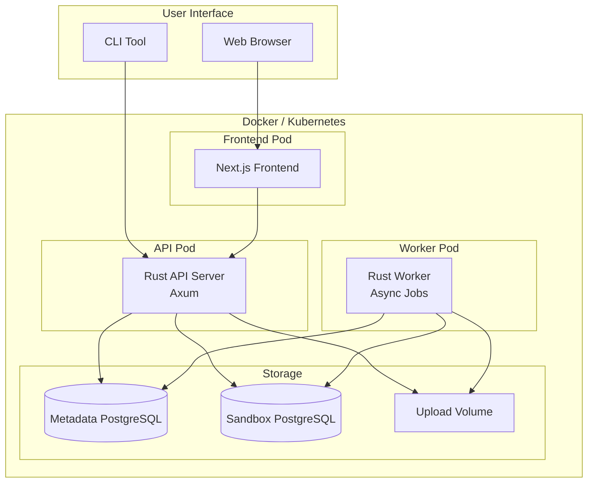

---

## 2. Component Diagram

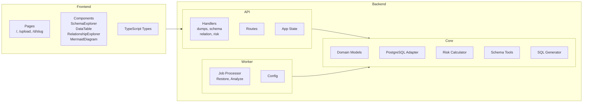

---

## 3. Dump Lifecycle Flow

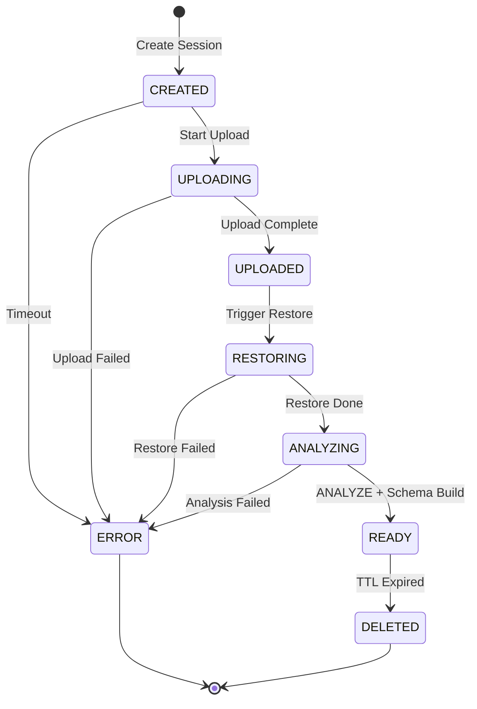

---

## 4. Request Flow - Upload & Restore

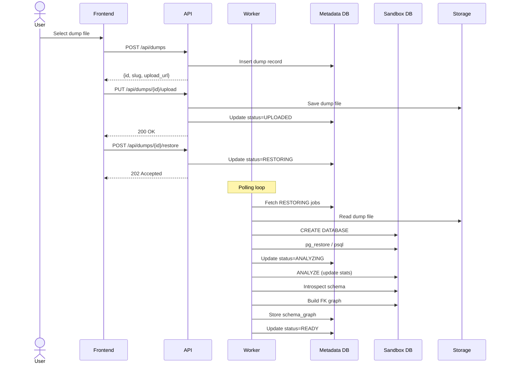

---

## 5. Request Flow - Data Browsing with Filter

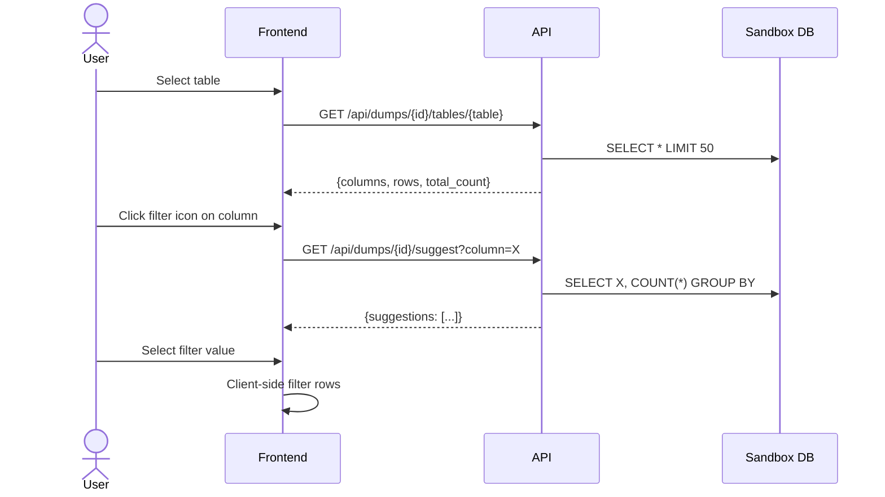

---

## 6. Request Flow - Relationship Exploration

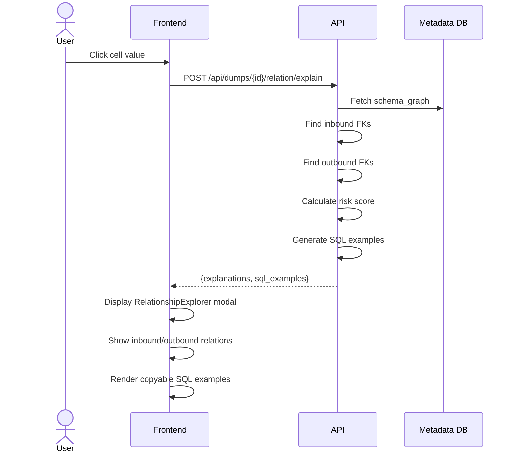

**表示条件:**
- **Inbound**: 他のテーブルがこのカラムを FK で参照している場合
- **Outbound**: このカラムが FK として他のテーブルを参照している場合

---

## 7. Dump Comparison & Data Diff Flow

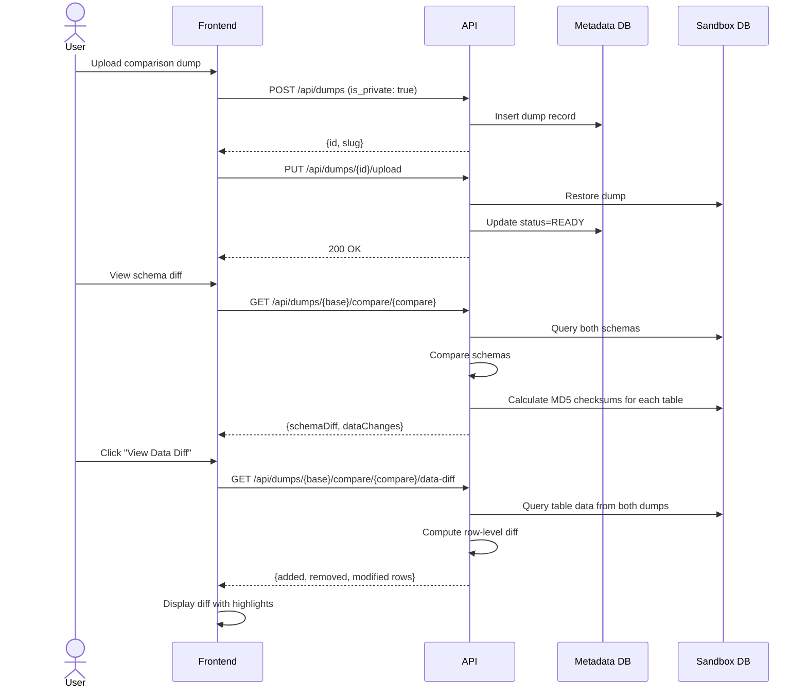

### Data Change Detection

データ変更は以下の方法で自動検出されます：

1. **MD5チェックサム計算**: 各テーブルの先頭10,000行に対してMD5チェックサムを計算
2. **比較**: ベースダンプと比較ダンプのチェックサムを比較
3. **変更フラグ**: チェックサムが異なる場合、`has_data_change: true` をセット

```sql
-- チェックサム計算クエリ
SELECT md5(string_agg(md5(t::text), '' ORDER BY t::text)) as checksum
FROM (SELECT * FROM "schema"."table" ORDER BY 1 LIMIT 10000) t
```

---

## 8. Risk Assessment Model

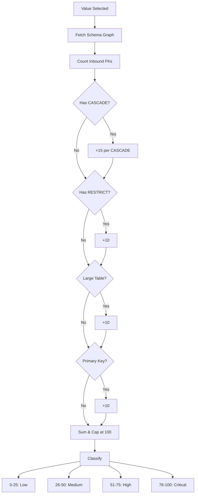

---

## 9. Docker Compose Configurations

| ファイル                  | 用途               | 特徴                               |
| ------------------------- | ------------------ | ---------------------------------- |
| `docker-compose.yml`      | 標準開発環境       | ビルド済みイメージ、全サービス起動 |
| `docker-compose.dev.yml`  | ホットリロード開発 | cargo-watch, yarn dev              |
| `docker-compose.prod.yml` | 本番環境           | Nginx リバースプロキシ付き         |

---

## 10. Kubernetes Deployment Architecture

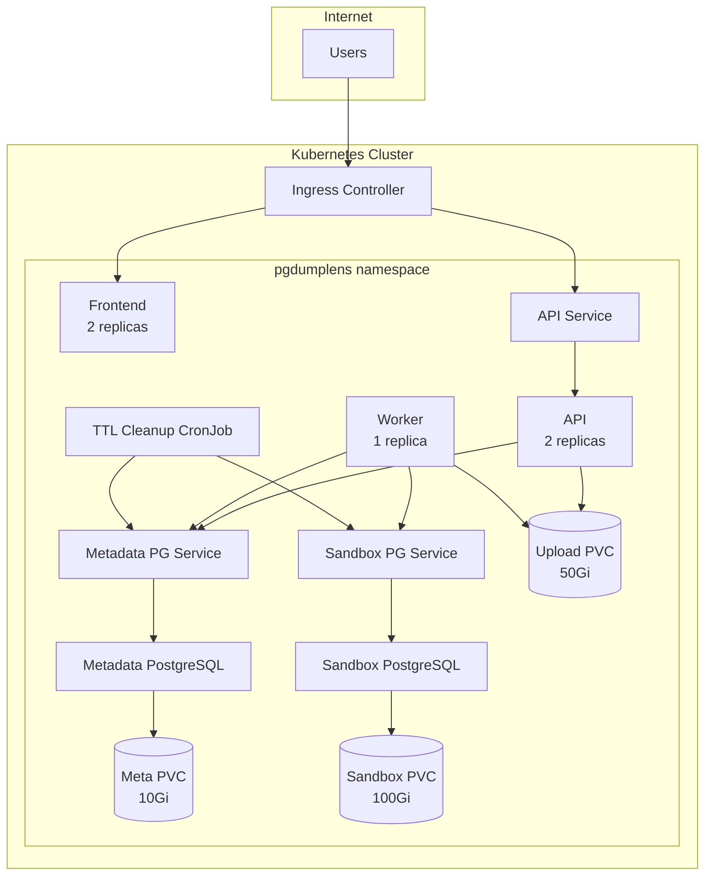

---

## 11. ER Diagram Generation Flow

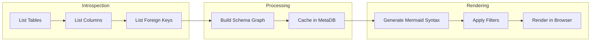

---

## 12. Data Flow Summary

| Flow          | Source           | Destination          | Data                  |
| ------------- | ---------------- | -------------------- | --------------------- |
| Upload        | Browser          | API → Storage        | Dump file             |
| Restore       | Worker → Storage | Sandbox DB           | SQL data              |
| Introspection | Sandbox DB       | Metadata DB          | Schema graph          |
| View          | Metadata DB      | API → Browser        | ER diagram, tables    |
| Query         | Sandbox DB       | API → Browser        | Row data              |
| Compare       | Sandbox DB x2    | API → Browser        | Schema diff           |
| Data Diff     | Sandbox DB x2    | API → Browser        | Row-level diff        |
| Cleanup       | CronJob          | Sandbox DB + Storage | Drop DB, delete files |

---

## 13. Technology Stack

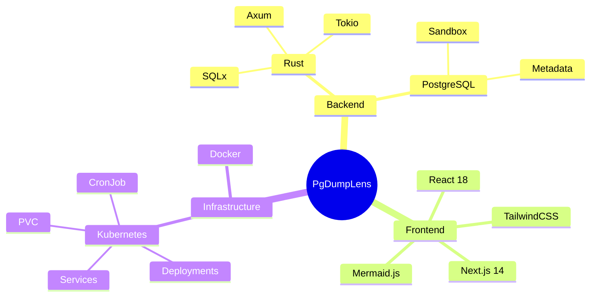

---

## Quick Start Commands

### Docker Compose (推奨)
```bash
# 標準起動
docker compose up -d

# ホットリロード開発
docker compose -f docker-compose.dev.yml up

# 本番環境
docker compose -f docker-compose.prod.yml up -d
```

### Backend (ローカル開発)
```bash
cd backend
cargo build --release
cargo test --workspace
cargo run --bin api-server
```

### Frontend (ローカル開発)

```bash
cd frontend
yarn install
yarn dev
yarn test
```

### Kubernetes
```bash
kubectl apply -f deploy/k8s/namespace.yaml
kubectl apply -f deploy/k8s/
```

---

*PgDumpLens - PostgreSQL Dump Visualization & Risk-Aware Explorer v0.1.0*
