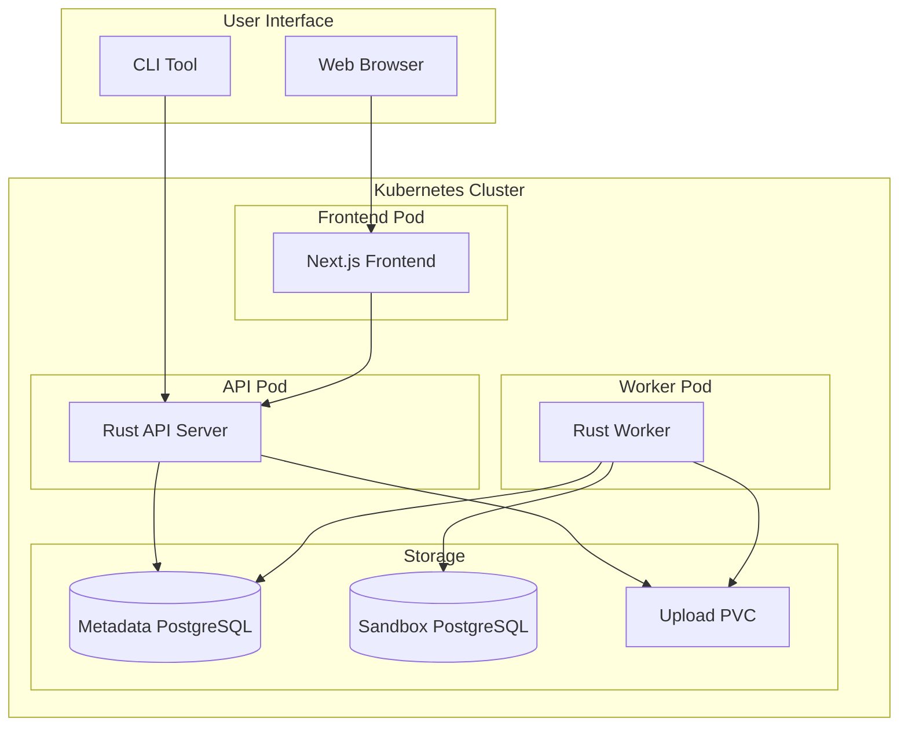
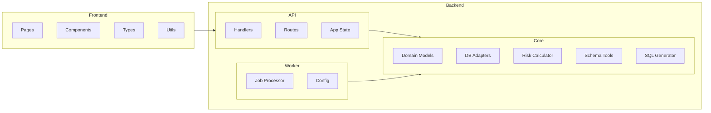
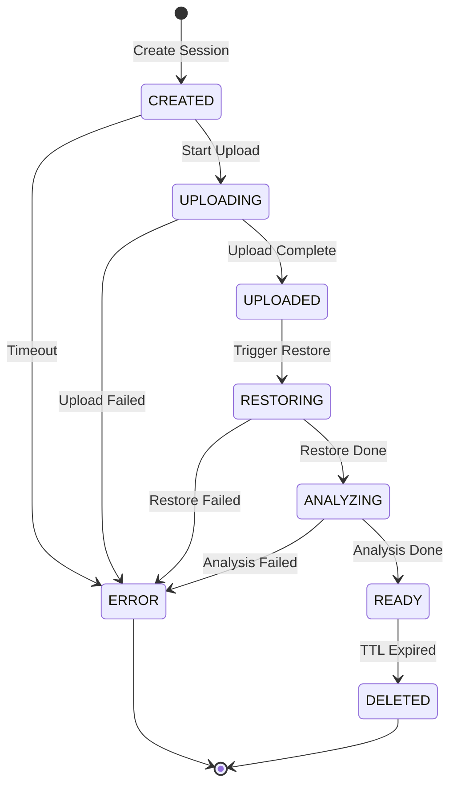
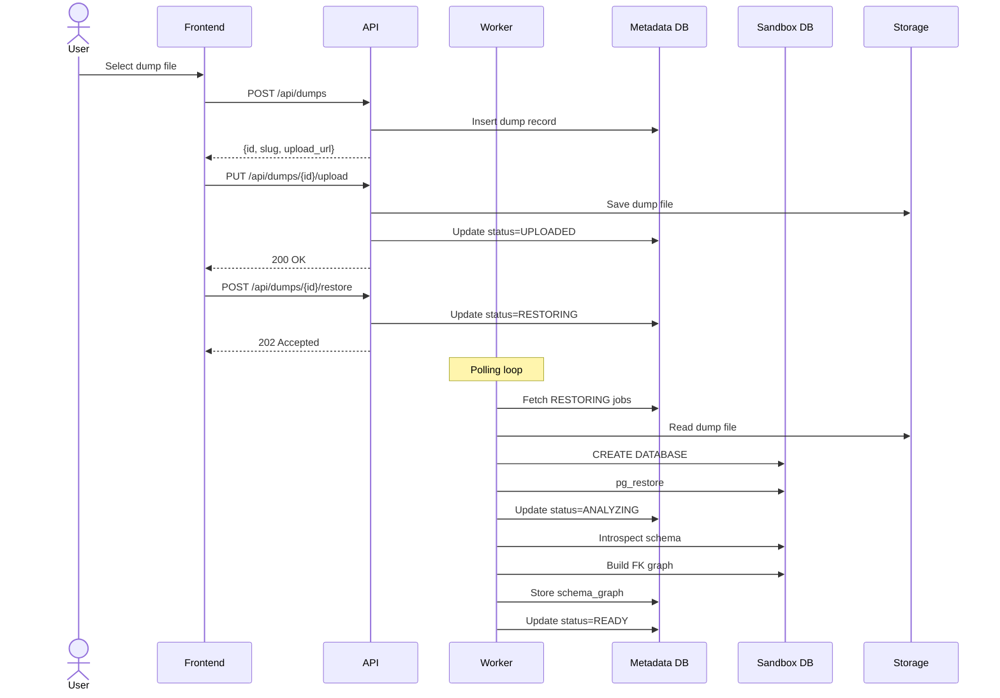
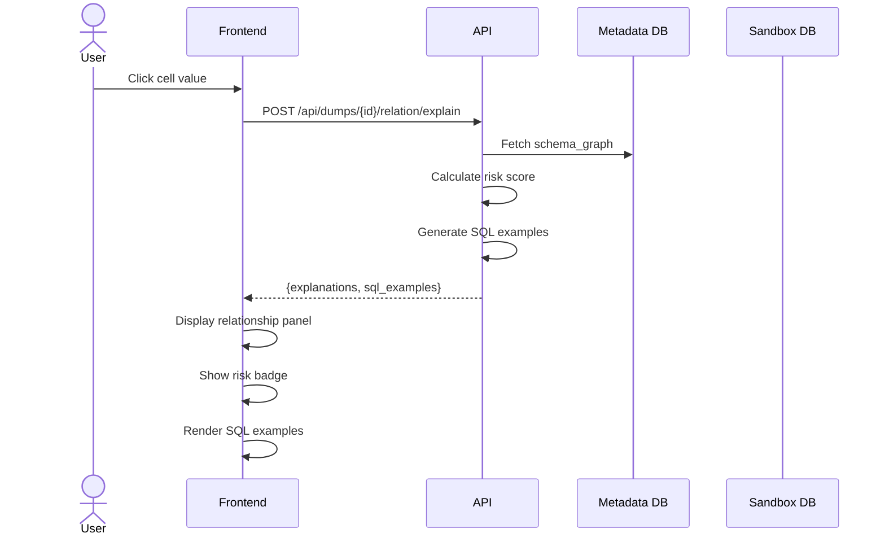
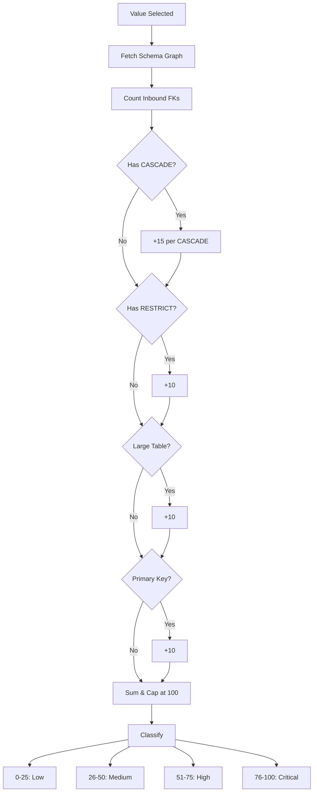
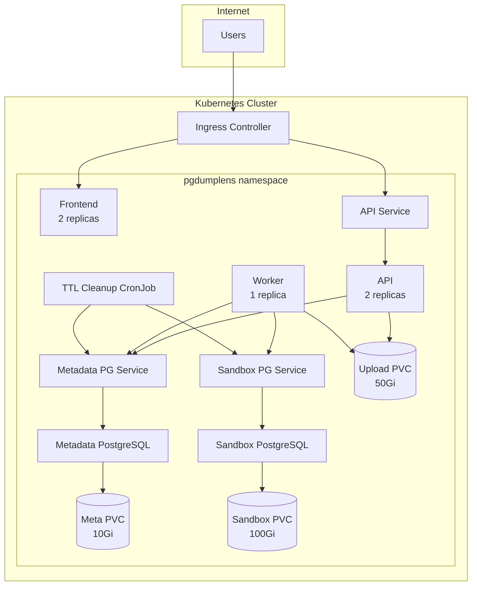
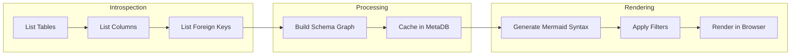
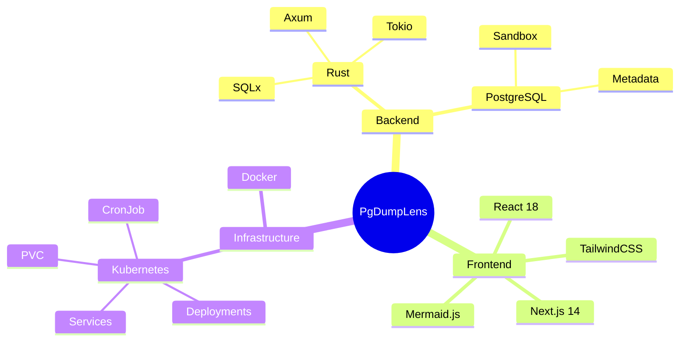

# PgDumpLens - Architecture Documentation

## System Architecture

This document provides visual diagrams explaining the PgDumpLens service architecture and workflows.

---

## 1. High-Level Architecture



---

## 2. Component Diagram



---

## 3. Dump Lifecycle Flow



---

## 4. Request Flow - Upload & Restore



---

## 5. Request Flow - Relationship Exploration



---

## 6. Risk Assessment Model



---

## 7. Kubernetes Deployment Architecture



---

## 8. ER Diagram Generation Flow



---

## 9. Data Flow Summary

| Flow | Source | Destination | Data |
|------|--------|-------------|------|
| Upload | Browser | API → Storage | Dump file |
| Restore | Worker → Storage | Sandbox DB | SQL data |
| Introspection | Sandbox DB | Metadata DB | Schema graph |
| View | Metadata DB | API → Browser | ER diagram, tables |
| Query | Sandbox DB | API → Browser | Row data |
| Cleanup | CronJob | Sandbox DB + Storage | Drop DB, delete files |

---

## 10. Technology Stack



---

## Quick Start Commands

### Backend
```bash
cd backend
cargo build --release
cargo test --workspace
```

### Frontend

```bash
cd frontend
yarn install
yarn dev
yarn test
```

### Kubernetes
```bash
kubectl apply -f deploy/k8s/namespace.yaml
kubectl apply -f deploy/k8s/
```

---

*Generated for DB Dump Visualization & Risk-Aware Explorer v1*
